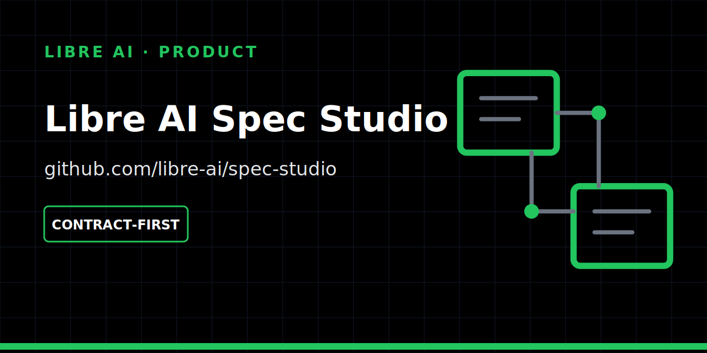

<p align="center">
  
</p>

# Libre AI Spec Studio

A product-conception workspace for turning conversations into decisions, specs and implementation handoffs.

## Status

| | |
| --- | --- |
| Maturity | **Contract-first** |
| Works today | local Rust CLI for workspace, package, validation and planning-only handoff |
| Not available yet | durable collaborative UI and production multi-actor workflow |
| Historical IDs | `rumble-canvas` remains the current crate/CLI identifier |

The CLI proves a bounded handoff path. It does not make Spec Studio a complete product or grant it execution ownership. See the canonical [product readiness cockpit](docs/product-readiness.md).

## Local proof

```bash
cargo run -p rumble-canvas -- workspace sample --store target/canvas.json
cargo run -p rumble-canvas -- package build --store target/canvas.json --out target/package.json
cargo run -p rumble-canvas -- handoff build --store target/canvas.json --out target/handoff.json
cargo run -p rumble-canvas -- handoff validate --store target/canvas.json --json
cargo run -p rumble-canvas -- handoff plan --store target/canvas.json --json
cargo test --workspace
```

`handoff plan` is always dry-run. Spec Studio describes intent and packages validated context; it does not execute implementation work.

## Architecture

```text
crates/domain   product workspace and traceability
crates/package  SpecPackage readiness, hashing and immutability
crates/handoff  bounded ImplementationHandoff generation
crates/store    local persistence adapter
crates/cli      package, validation and planning-only commands
```

The `spec-package.v0.1` schema and Proof Kit integration notes are versioned in this repository.

- [`docs/OPERATIONS.md`](docs/OPERATIONS.md)
- [`docs/WRENCH_INTEGRATION.md`](docs/WRENCH_INTEGRATION.md)
- [`specs/spec-package.v0.1.schema.json`](specs/spec-package.v0.1.schema.json)

## Boundaries

Spec Studio owns product meaning: assumptions, screens, flows, decisions and human validation. Independent infrastructure owns orchestration, inspection, persistence substrate and distribution. Handoffs are explicit and reviewable.

## Next milestone

Add durable multi-actor identity and provenance while preserving planning-only semantics.

## Contributing

- [Contribution guide](CONTRIBUTING.md)
- [Roadmap](ROADMAP.md)
- [Security policy](SECURITY.md)

## License

[MIT](LICENSE).
